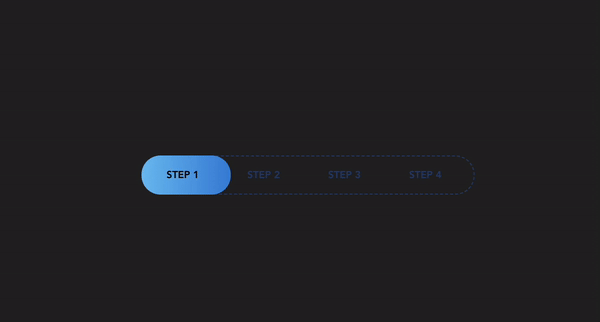

## Preview



## How to use?

```
import { Map } from "@vvkovaliov/map";

function App() {
    return (
        <div className="App">
            <Map>
                <div>
                    <span>Step 1</span>
                </div>
                <div>
                    <span>Step 2</span>
                </div>
                <div>
                    <span>Step 3</span>
                </div>
                <div>
                    <span>Step 4</span>
                </div>
            </Map>
        </div>
    )
}

```

## Available props

| PropType     | input       | default                                    |
|:-------------|-------------|--------------------------------------------|
| step         | number      | 0                                          |
| paddingRight | number      | 24                                         |
| paddingLeft  | number      | 24                                         |
| background   | string      | "linear-gradient(90deg, #74c1f2, #3e86d9)" |
| fontColor    | string(HEX) | "#000000"                                  |


